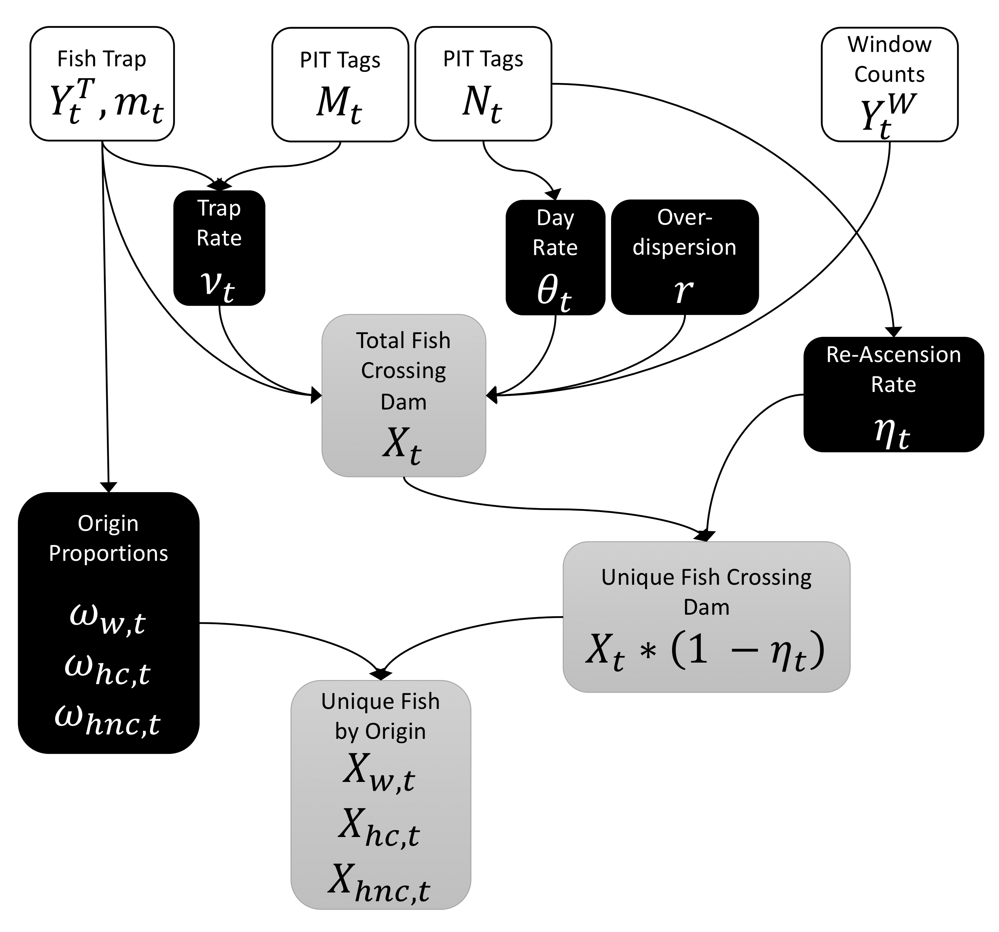

```{r setup, echo = FALSE}
knitr::opts_chunk$set(
  collapse = TRUE,
  warning = FALSE,
  message = FALSE,
  echo = FALSE,
  comment = "#>",
  fig.path = "../figures/",
  dpi = 300
)

# set default values for saving alternative figures (color versions)
my_dpi = knitr::opts_chunk$get()$dpi
my_ext = "tiff"
```


```{r load_libraries}
# setwd('analysis/paper')

library(tidyverse)
library(lubridate)
# library(msm)
# library(HDInterval)
library(magrittr)
library(ggpubr)
library(knitr)
library(kableExtra)

library(STADEM)

# set default theme for ggplot2
theme_set(theme_pubr())

# default options for tables
options(knitr.kable.NA = '-')

# when knitting to Word, use this
# what kind of document is being created?
doc.type <- knitr::opts_knit$get('rmarkdown.pandoc.to')

if(doc.type == 'docx') {
  options(knitr.table.format = "pandoc")
}

if(doc.type %in% c("docx", "html")) {
  theme_set(theme_pubr(base_family = "Times New Roman"))
}

```

```{r package-bibtex, eval = F}
knitr::write_bib(c("lubridate",
                   "msm",
                   "HDInterval",
                   "ggpubr",
                   "knitr", 
                   "rjags",
                   "rmarkdown"),
                 file = 'packages.bib')
```


```{r load_sim_results, cache = F}

result_nms <- list.files('../data/derived_data/SimulationFits')
result_nms <- result_nms[!grepl('other', result_nms)]
scenario_nms <- gsub('^Sim_', '', result_nms)
scenario_nms <- gsub('\\.rda$', '', scenario_nms)
# length(scenario_nms)

# compile all results into single dataframe
res_df <- scenario_nms %>%
  as.list() %>%
  rlang::set_names() %>%
  map_df(.id = 'Scenario',
         .f = function(nm) {
    load(paste0('../data/derived_data/SimulationFits/Sim_', nm, '.rda'))
    res %>%
      map_df(.id = 'sim',
             .f = identity)
  }) %>%
  mutate(Variable = factor(Variable, levels = c('Unique.Wild.Fish',
                                                'Unique.Hatch.Fish',
                                                'Unique.HNC.Fish',
                                                'All.Fish',
                                                'Daytime.Fish',
                                                'Night.Fish',
                                                'Reascent.Fish'))) %>%
  mutate(Scenario = recode(Scenario,
                           'Baseline_WinErr_high' = 'Baseline_Err_H',
                           'Baseline_WinErr_low' = 'Baseline_Err_L',
                           'NightReasc' = 'N-R',
                           'NightReasc_WinErr_high' = 'N-R_Err_H',
                           'NightReasc_WinErr_low' = 'N-R_Err_L',
                           'TrapShutdown' = 'TrapDown',
                           'TrapShutdown_WinErr_high' = 'TrapDown_Err_H',
                           'TrapShutdown_WinErr_low' = 'TrapDown_Err_L',
                           'NightReasc_TrapShutdown' = 'N-R_TrapDown',
                           'NightReasc_TrapShutdown_WinErr_high' = 'N-R_TrapDown_Err_H',
                           'NightReasc_TrapShutdown_WinErr_low' = 'N-R_TrapDown_Err_L'),
         Scenario = factor(Scenario, 
                           levels = paste0(rep(c('Baseline', 'TrapDown', 'N-R', 'N-R_TrapDown'), each = 3), 
                                           c('', '_Err_L', '_Err_H')))) %>%
  mutate(across(sim,
                as.integer))

#------------------------------------------------------
# Re-format res_df into long format of point ests.,
# CI's and CIin for both Models : STADEM, SCOBI
#------------------------------------------------------
res_long_df <- res_df %>%
  pivot_longer(cols = -(Scenario:Truth),
               names_to = "key",
               values_to = "point") %>%
  separate(key, into = c("Model","est"), sep = "_") %>%
  pivot_wider(names_from = "est",
              values_from = "point") %>%
  mutate(Model = recode(Model, 
                        "ISEMP" = "STADEM")) %>%
  rowwise() %>%
  mutate(se = (uppCI - lowCI) / (2 * qnorm(0.975)),
         cv = se / est,
         bias = est - Truth,
         rel_bias = bias / Truth,
         MSE = mean((bias)^2),
         inCI = ifelse(inCI == 1, T, ifelse(inCI == 0, F, NA)),
         Window = ifelse(grepl("H",Scenario),"Window_Err_High",
                         ifelse(grepl("L",Scenario),"Window_Err_Low","No Window Error")),
         Night = ifelse(grepl("N-R",Scenario),"Yes","No"))
```

```{r load-lgr-results}
lgr_res = list.files('../data/derived_data/STADEM_results') %>%
  as.list() %>%
  map(.f = function(x) {
    load(paste('../data/derived_data/STADEM_results', x, sep = '/'))
    
    tot_est = stadem_mod$summary %>%
      as_tibble(rownames = 'variable') %>%
      filter(grepl("X.tot.new", variable)) %>%
      mutate(cv = sd / mean) %>%
      mutate(Year = str_extract(x, "[:digit:]+") %>%
               as.numeric()) %>%
      select(Year, variable, mean, cv) %>%
      bind_rows(stadem_list$weeklyData %>%
                  group_by(Species) %>%
                  summarise_at(vars(mean = win_cnt),
                               list(sum),
                               na.rm = T) %>%
                  mutate(variable = "win_cnt")) %>%
      tidyr::fill(Year, Species,
                  .direction = "downup") %>%
      select(Species, Year, everything())
    
    rate_df = stadem_list$weeklyData %>%
      mutate(Year = str_extract(x, "[:digit:]+") %>%
               as.numeric()) %>%
      select(Species, Year, Start_Date:reascent_tags) %>%
      mutate(night_rate = 1 - day_tags / tot_tags,
             reasc_rate = reascent_tags / tot_tags)
    
    
    return(list(tot_est = tot_est,
                rate_df = rate_df))
    
  })

lgr_est = map_df(lgr_res,
                 .f = "tot_est")

rate_comp = map_df(lgr_res,
                   .f = "rate_df")

```

```{r test-rates-equality}
rate_test = rate_comp %>%
  mutate(night_tags = tot_tags - day_tags) %>%
  filter(tot_tags > 0,
         reascent_tags > 0,
         night_tags > 0,
         # reascent_tags >= 10,
         # night_tags >= 10,
         # tot_tags >= 20,
         reascent_tags < tot_tags,
         night_tags < tot_tags) %>%
  tidyr::nest(tag_data = -c(Species:win_cnt)) %>%
  mutate(tot_tags = map_dbl(tag_data,
                            "tot_tags"),
         prop_test = map(tag_data,
                         .f = function(df) {
                           prop.test(x = c(df$night_tags,
                                           df$reascent_tags),
                                     n = rep(df$tot_tags, 2),
                                     correct = F)
                         }),
         p_value = map_dbl(prop_test,
                           "p.value"),
         sig = if_else(p_value < 0.05, T, F))

# rate_test %>%
#   janitor::tabyl(sig) %>%
#   janitor::adorn_totals() %>%
#   janitor::adorn_pct_formatting()

```


# Introduction

Fish escapement refers to the number of adults that survive juvenile and subadult rearing, escape harvest, and achieve a size and age to potentially spawn [e.g., @Bue1998]. For anadromous fishes, escapement is often estimated at a fixed location in a river system prior to fish reaching their natal habitat to spawn [e.g., @Woody2004; @Jasper2018]. Escapement estimates facilitate effective fisheries management, particularly estimates of escapement for component groups [e.g., by stock, population, age, origin [wild, hatchery], @Hess2014; @Steinhorst2017; @Camacho2018] which provide valuable information that fisheries managers use to achieve sustainable harvest, while protecting small and vulnerable populations. Accurate escapement estimates are increasingly important for depleted populations as they inform status metrics [@McElhany2000] and facilitate assessments of population viability, extinction risk [@NWFSC2015; @Williams2016] and climate change vulnerability [@Crozier2019].

Populations of Chinook Salmon *Oncorhynchus tshawytscha* and anadromous steelhead trout *O. mykiss* in the Snake River basin of Pacific Northwest, USA, are depleted following decades of substantial harvest and anthropogenic changes to their migration corridor (e.g., construction of hydroelectric projects on the Snake and Columbia rivers) and tributary habitats [@Nehlsen1991; @McClure2003; @NWFSC2015]. As a result, most Snake River spring/summer-run Chinook Salmon (hereafter sp/sum Chinook Salmon) were classified as threatened in 1992 under the Endangered Species Act (ESA; Federal Registry Notice 57 FR 14653), and Snake River summer-run steelhead trout (hereafter steelhead) were listed as threatened five years later (Federal Registry Notice 62 FR 43937). Snake River sp/sum Chinook Salmon and steelhead have substantial cultural, recreational, commercial and subsistence value within the Snake River basin as well as in downstream corridors (i.e., Columbia River) and ocean fisheries. The aggregate escapement of Snake River sp/sum Chinook Salmon and steelhead populations, with the exception of Tucannon River (a tributary of the Snake River whose confluence is downstream of Lower Granite Dam [LGR]), is monitored at LGR located in southeast Washington; the final dam on the Snake River that returning adults must pass prior to heading to tributary spawning locations. Many fisheries management and conservation actions are made based on estimates of escapement by species and origin at LGR [@NMFS2019; @NWFSC2015; @NPCC2014]. As an example, tribal ceremonial and subsistence harvest rates in the region are informed by escapement at LGR; additionally, the openings, closures and bag limits of fisheries targeting hatchery fish, both upstream in Snake River fisheries and downstream in mainstem Snake and Columbia rivers, are informed by escapements at LGR [@USOregon2018]. 

The majority of sp/sum Chinook Salmon and steelhead returning to the Snake River must ascend a fish ladder on LGR before migrating upriver. Fish management agencies previously used counts of fish, by species, passing an observation window within the fish ladder as a census of fish escaping past the dam. For both species, total escapement was then parsed into groups (e.g., wild, hatchery) using observed marks and genetic data from a sample of fish captured at an adult trap located on the fish ladder upstream of the observation window [@Camacho2018; @Steinhorst2017; @Steele2019]. Treating window counts as a census proved beneficial as being an easy, straight-forward method ascertained in near real-time. Moreover, downriver fisheries management arenas have used window counts at lower-river dams as escapement estimates for the past several years, and consistency in methods is often desirable for management decision making [@WDFW2019]. 

However, using window counts as a census of fish passing LGR can be problematic as it fails to account for multiple sources of uncertainty and disregards known biological processes. Typically, the observational error rates of sp/sum Chinook Salmon and steelhead counted passing a window on the fish ladder, using both in-person and video methods, are unknown, and sampling error rates are ignored. @Hatch1994 conducted a study of the counting system at LGR, and found that sp/sum Chinook Salmon were undercounted at the window by in-person window counters when compared to video counts. There was also a significant difference between daily standard counts (16 or 10 hours per day) and daily 24-hour video counts; the undercounting was attributed to a significant nighttime passage rate (crossing while the counting window was closed) with an estimated 3.5% of sp/sum Chinook Salmon and 6.6% of steelhead adults passing during "nighttime" hours. They also found some species misidentification issues, which could result in either under- or over-counting of a particular species. While that study identified potential issues with the current window counting procedure, it was only conducted in a single year, nearly 30 years ago, and at a time when sp/sum Chinook Salmon and steelhead total returns were typically lower than in the past decade. 

One additional biological process, the fallback and re-ascension of adult migrants at the dam, should also be accounted for to estimate the true escapement of these species at LGR. Adult fish that migrate through the ladder and past the dam may fallback over the dam (e.g., over a spillway, through navigation locks) and later may re-ascend the fish ladder again [@Boggs2004] and be counted multiple times at the window (re-ascension). Whereas unaccounted nighttime passage can lead to an underestimate in escapement, both fallback without and with re-ascension instead potentially lead to an overestimate of escapement [@Dauble2000]. Previously, it has often been assumed that these two biological processes essentially cancel each other out, resulting in window counts that provide an unbiased estimate of escapement [@Camacho2018], which may be true in many or most years, but perhaps not always.

In this study, we describe a novel method to estimate aggregate and group escapements which incorporate all sources of known uncertainty and demonstrate that the estimation method is essentially unbiased, thus better informing conservation and management decision making. We also test whether observed nighttime passage and fallback/re-ascension rates are typically equal. Our method for estimating species-specific escapement past LGR incorporates window counts, data from the adult fish trap located on the ladder, and passive detections of adults in the ladder from fish previously tagged with passive integrated transponder (PIT) tags to explicitly model nighttime passage, re-ascension, and observation error using a state-space approach [@Royle2008] which separates process variance (e.g., week to week variance in true escapement) from observational variance (e.g., observation error at the window, or sampling variance at the trap). To meet desired management and conservation objectives, modeled escapement includes estimates of uncertainty and is parsed into weekly strata. Further, total and weekly estimates are divided into three origin groups: wild fish, hatchery fish with a clipped adipose fin, and unclipped hatchery fish. Our model is implemented in the **ST**ate-space **A**dult **D**am **E**scapement **M**odel (STADEM) package for the statistical software R [@R-Core-Team2020], and is available for download or installation from [https://github.com/KevinSee/STADEM](https://github.com/KevinSee/STADEM). To validate the STADEM results, we simulated 12 scenarios with varying trapping rates, fallback and re-ascension rates, nighttime passage rates, and window count error rates and compared STADEM results to the simulated "truth". Then, as a case study, we applied this model to sp/sum Chinook Salmon and steelhead returns at LGR for spawn years 2010 - 2019. 

# Methods

## Data Requirements

Data sources for STADEM included 1) counts of fish migrating past the observation window located on the adult fish ladder at LGR, 2) information from adults captured at a fish trap located in the fish ladder, and 3) observations of fish PIT tagged prior to arriving at LGR and detected at arrays in the adult fish ladder. Below, we describe each of the data sources in more detail as they pertain to LGR; similar data could likely be obtained from other species passing LGR (e.g., fall Chinook Salmon) or other fish passage facilities (e.g., Bonneville Dam).

### Window Counts

Daily counts of adult sp/sum Chinook Salmon and steelhead passing the observation window located on the LGR fish ladder were compiled and provided by the US Army Corps of Engineers. When summed, they provide an estimate of the number of fish ascending and passing LGR each season. Window counts were made for each species using direct in-person visual monitoring and video monitoring during daytime hours [@Hatch1994]. Direct visual monitoring occurred during peak run times (April 1 – October 31) for 16 hours per day (0400 – 2000 hours). Video monitoring occurred during the beginning and tail ends of the adult runs (March 1 – March 31 and November 1 – December 31) for 10 hours per day (0600 – 1600 hours) [@USACE2015]. During direct visual monitoring, observers recorded each adult (≥ 30cm), by species, passing the window for 50 minutes of each hour of operation. The sum of the daily 50-minute counts were then multiplied by 1.2 to account for the 10 minutes each hour when fish were not counted. Daytime window counts were not expanded for fish that may have ascended the ladder outside of operational hours (i.e., nighttime passage) [@USACE2015]. Window counts were accessed through the Columbia Basin Research Data Access in Real Time (DART) website, [www.cbr.washington.edu/dart/query/adult_daily](www.cbr.washington.edu/dart/query/adult_daily), using their window count query. Counts were provided for each day the fish ladder was open to passage, and had already been expanded by 1.2.

### Adult Fish Trap Data

The second source of data are from a sample of fish collected in the adult trap as they migrated past LGR [@Ogden2016b]. The trap, also located within the adult fish ladder and upstream of the observation window, provides an opportunity to collect biological data (e.g., phenotypic origin [wild, hatchery], tissue sample for genetic data, length, scale sample for age, sex) from captured adults which allows for decomposition of the escapement into specific groups [e.g., @Camacho2018; @Steinhorst2017]. The trap was operational for 24 hours per day and randomly sampled the run by opening four times per hour for a length of time determined by a set daily trapping rate. The trap rate was determined by a committee of collaborating management agencies with a goal of capturing a target number of wild fish while also balancing fish handling concerns. Trap sample rates were typically 10-25%, but fluctuated throughout the season due to, for example, high water temperatures, decreased flows, trap malfunctions and/or closures, fish handling logistics, in-season forecast adjustments, or adjustments due to shifting species composition throughout the year.

All captured fish were anesthetized, identified to species, examined for existing marks or tags, measured for fork length, and visually identified as wild or hatchery. The most widely used marking of hatchery fish is a clipped (removed) adipose fin, although coded wire tags are also used in less than 10% of the hatchery releases. Some subset of hatchery fish are either intentionally or unintentionally released without a clipped adipose fin, and these are referred to as unclipped hatchery fish, or hatchery no-clips. For adults with intact adipose fins (unclipped), which includes wild and hatchery no-clip individuals, either a portion or all of the fish trapped (depending on the year) had scale and genetic tissue samples taken. Scale samples were used to estimate age [@Wright2015] and genetic tissue samples were used to determine sex [@Campbell2012] and estimate the location of origin of wild fish using genetic stock identification [e.g., @Hargrove2019]. Prior to 2013, only fish determined to be wild in origin at the trap were sampled for scale and genetics. Starting in 2013, every unclipped sp/sum Chinook Salmon and steelhead trapped at LGR was genotyped to simplify collaborative logistics and to better estimate the true proportion of unclipped hatchery fish that can otherwise appear phenotypically wild. @Camacho2018 provide further details on trap sample rates and valid sample selection. Prior to release, all non-PIT tagged fish with an intact adipose fin (i.e., putatively wild) received a PIT tag. Final determination of wild, clipped hatchery, or unclipped hatchery origins were assigned using a post-hoc analysis of marks and tags, including parentage-based tagging based on the genetic samples taken [@Steele2013; @Steele2019]. Data from the adult trap were collected and managed by multiple agencies and were made available by the Idaho Department of Fish and Game [@Camacho2018].

### PIT Tag Data

The last source of data were observations of PIT tagged adult sp/sum Chinook Salmon and steelhead at PIT tag detection sites located in the LGR fish ladder. These observations provide data related to 1) an estimate of the "true" trap rate for the adult fish trap, 2) a nighttime passage rate, and 3) a re-ascension rate. Detections used in the model included all fish that were previously PIT tagged as juveniles or adults prior to arriving at LGR (i.e., does not include newly tagged adults at the dam) and detected at adult detection sites in the dam passage system. PIT tag data were provided through DART and the adult ladder PIT tag query; [http://www.cbr.washington.edu/dart/query/pitadult_obsyr_detail](http://www.cbr.washington.edu/dart/query/pitadult_obsyr_detail).


## Model Framework

### Total and Weekly Escapement 

Escapement at LGR is estimated by combining two independent observations, trap catches and window counts, of the true number of fish crossing the dam in a state-space model [@Royle2008], with a weekly time-step. Both are assumed to be corrupted observations of the true unknown number of fish crossing LGR each week. We chose to use a weekly time-step to ensure sufficient sample sizes of PIT tag detections within each time strata, but this choice could be easily modified. The log of the true number of fish crossing during time-step $t$, ($X_t$), is modeled as a random walk process [@Shumway2010], with $e_t$ representing the process errors drawn from a normal distribution with variance $\sigma^2_X$.

\begin{equation}
  \begin{aligned}
    \ln \left( X_{t} \right) &= \ln \left( X_{t-1} \right) + e_t \\
    e_t &\sim \text{Normal}(0, \sigma^2_X)
  \end{aligned}
\end{equation}

The number of fish caught in the trap, $Y^T_t$, for week $t$ is modeled as a binomial process based on the unknown true trap rate that week, $\nu_t$, and the unknown true number of fish crossing the dam that week, $X_t$. 

\begin{equation}
  Y^T_t \sim \text{Bin} \left( \nu_t, X_t \right)
\end{equation}

The set trapping rate (i.e., the pre-determined time that the trap is open each hour to trap adults) does not always reflect the true trapping rate or proportion of fish actually captured in the trap due to various issues including trap malfunctions, separation-by-code fish opening the trap more frequently than expected, and process error (pulses or lack thereof of passing adults), among others. Therefore, we use a mark-recapture approach to estimate a "true" trapping rate, $\nu_t$. The estimate of the true weekly trap rate is derived based on previously PIT-tagged sp/sum Chinook Salmon and steelhead that are crossing LGR that week, and uses a Lincoln-Peterson mark-recapture model [@Seber2002]. 

\begin{equation}
  m_t \sim \text{Bin} \left( \nu_t, M_t \right)
\end{equation}

The fish, from both species, caught in the trap that week are considered the "mark" group ($m_t$), and all the previously PIT tagged fish who are detected at the upper end of the LGR fish ladder that week are considered the second "capture" group, $M_t$ (which includes recaptures of the "marked" fish). The proportion of previously marked fish that are caught in the adult trap, $m/M$ can be modeled with a binomial distribution using the same trap rate parameter, $\nu_t$. Although the group of previously PIT tagged fish is not assumed to be representative of the overall run, the rate at which they are caught in the trap should be the same rate that the overall run experiences. The more tagged fish crossing the dam in a particular week, the more certain we can be of the true trap rate.

The number of fish counted at the window, $Y^W_t$, is modeled as a (potentially) over-dispersed negative binomial process, with an expected value of $X_t^{day}$, the number of fish crossing the dam while the window is open. This is simply the total number of fish crossing that week, $X_t$, multiplied by the proportion of fish crossing while the window is open for counting, $\theta_t$. In the formula below, $p_t$ is the probability parameter and $r$ is the size parameter of a negative binomial distribution (as defined in @R-rjags). If $r$ is estimated to be small it provides evidence for over-dispersion, and as it grows very large, the negative binomial distribution behaves like a Poisson distribution.

\begin{equation}
  \begin{aligned}
    X_t^{day} &= X_t * \theta_t \\
    p_t &= \frac{r}{\left( r + X_t^{day} \right)} \\  
    Y^W_t &\sim \text{NegBin} \left( p_t, r \right) \\
  \end{aligned}
\end{equation}

Thus, the unknown true number of fish crossing LGR each week, $X_t$, is estimated from two different data sources: window counts and fish sampled in the trap. The window counts provide an estimate (with some potential observer error) of the fish crossing during daytime hours, while the fish in the trap, when expanded by the estimated true trap rate, provide an estimate of the total fish crossing that week. The use of both estimates allows for an estimation of observer error in the window counts which has previously been inestimable. For weeks when the trap is down, STADEM relies exclusively on the window counts and nighttime passage data, but there will be more uncertainty in the estimates.

### Daytime Passage and Re-ascension Rates

There are two processes that must be accounted for to correct any bias in the window counts: first, the proportion of fish that cross the dam while the window is closed for counting (nighttime passage rate), and second, the proportion of fish that cross the dam multiple times (re-ascension rate) and therefore potentially counted multiple times. Both rates can be estimated from previously PIT tagged fish that are crossing the dam each week.

The nighttime passage rate is just the complement of the rate of fish passing during the day when the window is operating. The daytime passage rate for week $t$, $\theta_t$, is modeled as a random walk process (with deviations, $g_t$, drawn from a normal distribution with variance $\sigma^2_{\theta}$) and estimated from a binomial distribution based on the number of PIT tags observed to cross the dam during operational hours, $y^{day}_t$, and the total number of PIT tags observed to cross the dam at any point that week, $N_t$ [@Shumway2010].

\begin{equation}
  \begin{aligned}
    y^{day}_t &\sim \text{Bin} \left(\theta_t, N_t \right) \\
    \text{logit} (\theta_{t}) &= \text{logit} \left( \theta_{t-1} \right) + g_t \\
    g_t &\sim \text{Normal}(0, \sigma^2_\theta) \\
  \end{aligned}
\end{equation}

The number of total fish crossing LGR differs from the number of unique fish crossing LGR because some fish fallback and re-ascend the dam. These fish are potentially double-counted (or more) at the window, and have the potential to be caught in the fish trap more than once. The number of tags known to be re-ascending the dam each week, $y^{reasc}_t$, is modeled as a binomial process based on the estimated re-ascension rate, $\eta_t$, and the total number of tags crossing the dam that week, $N_t$. The logit of the re-ascension rate is modeled as a random walk process similar to daytime passage [@Shumway2010], with deviations, $f_t$, drawn from a normal distribution with variance $\sigma^2_\eta$.

\begin{equation}
  \begin{aligned}
    y^{reasc}_t &\sim \text{Bin} \left(\eta_t, N_t \right) \\
    \text{logit} \left( \eta_{t} \right) &= \text{logit} \left(\eta_{t-1} \right) + f_t \\
    f_t &\sim \text{Normal}(0, \sigma^2_\eta)
  \end{aligned}
\end{equation}

We looked for differences in weekly nighttime passage and re-ascension rates estimated using wild fish only, versus combining hatchery and wild fish together, and found no difference. Additionally, sample sizes of observed tags during most weeks are small, and may prohibit reliable estimation of rates for individual wild or hatchery stocks. Therefore, we combine wild and hatchery PIT tagged fish observations to estimate common nighttime passage and re-ascension rates to increase sample sizes.

### Origin Proportions

After estimating the total number of fish to have crossed LGR each week, $X_t$, the total must be further refined into the number of wild fish, $X_{w,t}$, hatchery clipped fish, $X_{hc,t}$ and hatchery no-clip fish, $X_{hnc, t}$. This is done by estimating a weekly origin proportion vector, $\omega_t$ based on the random sample of fish caught in trap that week, $Y^T_t$. The observed number of wild, $Y^T_{w,t}$, hatchery clipped, $Y^T_{hc,t}$, and hatchery no-clip, $Y^T_{hnc,t}$, fish caught in the trap that week is assumed to come from a multinomial distribution with probability vector $\omega_t$. The log-odds ratio of the proportions in $\omega_t$, in relation to the proportion of clipped hatchery fish $\omega_{hc,t}$ ($\phi_{w,t}$ and $\phi_{hnc,t}$), is modeled as a random walk, so it can change through time, while smoothing over large weekly fluctuations in the proportions due to small sample size. This allows the proportions of wild, hatchery clipped and hatchery no-clip fish to shift throughout the season, based on the data available from the fish trap. The random walk deviations, $d_{w,t}$ and $d_{hnc,t}$, are drawn from the same normal distribution with variance $\sigma^2_\omega$.

\begin{equation}
  \begin{aligned}
    \left( Y^T_{w,t}, Y^T_{hc,t}, Y^T_{hnc,t} \right) &\sim \text{Multinom} \left( \omega_t, Y^T_t \right) \\
    \omega_t &= \frac{\exp(\phi_t)}{\sum{\exp(\phi_t})} \\
    \phi_{hc,t} &= 0 \\
    \phi_{w,t} &= \ln \left( \frac{\omega_{w,t}}{\omega_{hc,t}} \right) \\
    \phi_{hnc,t} &= \ln \left( \frac{\omega_{hnc,t}}{\omega_{hc,t}} \right) \\
    \phi_{w,t} &= \phi_{w, t-1} + d_{w,t} \\
    \phi_{hnc,t} &= \phi_{hnc, t-1} + d_{hnc,t} \\
    d_{w,t} &\sim \text{Normal}(0, \sigma^2_\omega) \\
    d_{hnc,t} &\sim \text{Normal}(0, \sigma^2_\omega) \\
  \end{aligned}
\end{equation}

Finally, the number of unique fish by origin crossing LGR each week ($X_{w,t}$, $X_{hc,t}$, and $X_{hnc,t}$) is the product of the total fish crossing that week, $X_t$, multiplied by one minus the re-ascension rate, $(1 - \eta_t)$, and the origin proportion vector, $\omega_t$.

\begin{equation}
  \begin{aligned}
    \begin{bmatrix} X_{w,t} \\ X_{hc,t} \\ X_{hnc,t} \end{bmatrix}
    &= X_t * (1 - \eta_t) * \begin{bmatrix} \omega_{w,t} \\ \omega_{hc,t} \\ \omega_{hnc,t} \end{bmatrix}
  \end{aligned}
\end{equation}

In practice, the total number of fish crossing LGR each week, $X_t$, could be split into other discrete groups if desired; for example, individual wild stocks using genetic stock identification or hatchery stocks with parentage based tagging [@Steele2019]. A graphical depiction (directed acyclic graph) of the model framework described above is found in Figure \@ref(fig:dag-fig). 

### Model Fitting

The model was fit using the JAGS program [@R-rjags], run with R software [@R-Core-Team2020]. The STADEM package is available from the primary author at [https://github.com/KevinSee/STADEM](https://github.com/KevinSee/STADEM), and requires the use of the JAGS software [@R-rjags] for Bayesian inference. Variance parameters $\sigma_X, \sigma_\eta, \sigma_\theta$, and $\sigma_\omega$, as well as the initial abundance, $X_1$, and the overdispersion parameter of the negative binomial, $r$, were given half-Cauchy priors with mean of 0 and scale of 100. The initial daytime passage and re-ascension rates, $\theta_1$ and $\eta_1$ were given Uniform(0,1) priors. Finally, $\phi_{w,1}$ and $\phi_{hnc,1}$ were given priors of Uniform(-3,3), in an effort to make $\omega_1$ as uninformative as possible.

## Simulations

We tested the STADEM model on a variety of simulated data sets, constructed to mimic some dynamics of interest at LGR. These simulated data sets each contained a fixed number of unique adult fish of known origin crossing a dam, from a total of 25 fictional populations with differential run-timing (i.e., date of passage at LGR). Each simulated fish was given a date of ladder ascension, based on its population and the range of observed run timing for that population. Each fish was also simulated to cross the dam either while the window was open for counting, or not, and was given the chance to be "caught" in the simulated fish trap given the week when it ascended the dam, and the known trap rate that week. Fallback and re-ascension behavior was also simulated, with each fish having the possibility of falling back and re-ascending the ladder up to three times.

Our objective was to assess STADEM model estimates of origin-specific (wild, hatchery, hatchery no-clip) escapement for accuracy and precision, given a known simulated "truth", under different possible conditions. We developed those conditions from the combinations of two trap rate scenarios (constant and shut down for 3 weeks), two fallback/re-ascension and nighttime passage combinations (equal and unequal), and three window count error rates (none, low and high); resulting in twelve different scenarios overall (Table \@ref(tab:lgr-sim-tab)). The simulation parameters such as proportion of origin, run-timing, nighttime passage rates, fallback and re-ascension rates and trap rates were based on observed values at LGR between 2010-2015. We generated 500 simulations for each scenario, and ran STADEM on each one, resulting in a total of 6,000 model runs. Further details about the simulation procedures can be found in [Appendix A](#append1).

To assess the performance of the model, we evaluated the estimates of origin-specific escapement by several measures. Accuracy was captured by the mean relative bias: the difference between the simulated "truth" and the STADEM estimate for each simulation, divided by the simulated "truth". We estimated the precision by examining the average coefficient of variation (CV) of the estimates. We calculated the root mean squared error (RMSE) as the square root of the mean of the squared bias in the estimate, which is equivalent to the square root of the variance of the estimator plus the square of the expected bias. Finally, we evaluated whether estimates of uncertainty were appropriate by calculating coverage probabilities to determine what proportion of the model results generated an estimated 95% credible interval that contained the simulated true value. To compare the STADEM results directly to window counts, we compared the model estimates of total unique fish and the simulated window counts to the simulated number of unique fish.

## Lower Granite Dam Application

We applied STADEM to empirical data from LGR for sp/sum Chinook Salmon and steelhead returning to the Snake River during spawn years 2010 to 2019. Window counts for both species were accessed from DART via functions within STADEM. For sp/sum Chinook Salmon, a spawn year refers to adults that migrate past the dam prior to August 17 each year and spawn that late summer and fall. For steelhead, the spawn year is defined as steelhead that migrate past LGR starting July 1 the previous year and prior to June 30 of the given year (e.g., spawn year 2017 steelhead migrate past LGR between July 1, 2016 and June 30, 2017). Data from the adult trap were made available by Idaho Department of Fish and Game, and adult PIT tag detection data within the fish passage ladder at LGR were accessed through DART and the adult ladder PIT tag query ([http://www.cbr.washington.edu/dart/query/pitadult_obsyr_detail](http://www.cbr.washington.edu/dart/query/pitadult_obsyr_detail)).

All data used in this manuscript, as well as associated code for both the simulations and the LGR application, can be found at [https://www.github.com/KevinSee/ManuscriptSTADEM]([https://www.github.com/KevinSee/ManuscriptSTADEM]). 

# Results

## Simulations

The evaluation statistics (relative bias, CV, RMSE, coverage probabilities) to assess performance of the STADEM model were very similar among hatchery clipped (N = 70,000), hatchery no-clip (N = 5,000) and wild fish (N = 25,000). In the interest of brevity, we only present the results from wild fish here, which corresponds to a moderate sized escapement relative to the hatchery clipped and hatchery no-clip groups. 

STADEM results showed similar patterns for estimates of unique total fish and unique wild fish, in that both were unbiased with similar variance in the estimator across all scenarios as seen in the consistent interquartile range in the boxplots of Figure \@ref(fig:rel-bias-lgd). For unique total fish, window counts were unbiased, except in scenarios when night passage and re-ascension rates were not equal (N-R). In those scenarios, they were biased by nearly 5% (Figure \@ref(fig:rel-bias-lgd)), the designed simulated difference between night passage and re-ascension rates (Table \@ref(tab:lgr-sim-tab)). The variance of the window counts also grew as the simulated observer error grew (no error vs. Err L vs. Err H), whereas the variance in the STADEM estimates remained fairly constant, albeit often larger than the window count variance.

Estimates of wild escapement were unbiased, with an average relative bias of 0.2–0.3%, although the bias appeared equally distributed between positive and negative values across the simulations (Figure \@ref(fig:rel-bias-lgd)). The CV of the estimates averaged 2.0–3.0%, with higher CV's being associated with scenarios with a simulated trap closure for 3 weeks. The coverage probabilities always exceeded 95% across all scenarios. The RMSE was near 500 for each scenario, representing an estimate within 2% of the true value, demonstrating the accuracy and precision of STADEM (Table \@ref(tab:summ-tab)).

## Lower Granite Dam Application

We applied STADEM to data from LGR for sp/sum Chinook Salmon and steelhead for spawn years 2010–2019. Estimates of total escapement, as well as estimates of wild, hatchery clipped, and hatchery no-clip estimates are presented in Table \@ref(tab:lgr-tab). Estimates of total unique fish escaping past LGR were sometimes higher and sometimes lower than the raw window counts, indicating that the relative strength of nighttime passage and re-ascension rates differed across years. Window count bias ranged from -3.0% to 11.0% for sp/sum Chinook Salmon and -9.9% to 6.6% for steelhead. STADEM coefficients of variation ranged from 2.5 to 7.1% for wild fish, 2.3 to 5.1% for clipped hatchery fish, 3.4 to 8.8% for hatchery no-clip fish and 2.2 to 4.7% for total unique fish past LGR.   

Weekly STADEM estimates of escapement over LGR tracked the window counts and trap estimates, with smaller credible intervals than the trap estimates alone. (One example: Figure \@ref(fig:jags-fit-fig). Similar plots for all model runs [each species and year combination] are available on the manuscript GitHub page: [https://www.github.com/KevinSee/ManuscriptSTADEM]([https://www.github.com/KevinSee/ManuscriptSTADEM])). 

Weekly nighttime passage and re-ascension proportions were significantly different (2-sample test of proportions, *p* < 0.05) in approximately 50% of the weeks with sufficient PIT tag data to test. The differences in the estimated weekly rates were also apparent visually (Figure \@ref(fig:night-reasc-diff-fig)). In particular, there were several weeks when the window counts were quite large, but the nighttime passage and re-ascension rates differed by as much as 10%; leading to larger window count bias in some years (Table \@ref(tab:lgr-tab)).

# Discussion

We have presented a novel method for estimating adult salmonid escapement past a large hydroelectric facility (e.g., LGR) that incorporates data from window counts, a fish trap, and observations of PIT tagged fish in the adult passage ladder. Our model explicitly accounts for nighttime passage, re-ascension, and potential error in both window and trap estimates. In doing so, we demonstrated that at LGR, nighttime passage and re-ascension rates do not always offset each other, and assuming they do will lead to biased escapement estimates in some years. Our state-space model combined multiple imperfect sources of data to reduce bias in adult escapement estimates and provided quantitative estimates of uncertainty. Using both data streams proved beneficial, and protected estimates from unforeseen problems or periodic biases in observations (e.g., trap closures, unequal night time and re-ascension rates). Accurate population or group abundance estimates and uncertainty accounting for observation and process error can be particularly important when estimates are used for management and conservation decisions such as population viability analyses [@Paulsen2007].

The results from our simulations demonstrate that STADEM provides consistent, unbiased estimates of escapement across a range of scenarios. Regardless of whether observer error at the window is negligible, low or high, whether nighttime passage and re-ascension rates are equal or not, whether the trap is shut down for several weeks in a season or not, STADEM produced estimates of unique escapement that were unbiased, precise (CVs in the 2-3% range) and contained appropriate credible intervals. Although the average bias among runs within a given simulation scenario was often positive (Table \@ref(tab:summ-tab)), Figure \@ref(fig:rel-bias-lgd) shows that for each scenario some simulations resulted in a negative bias, while some had a positive one. We posit that conducting additional simulations would bring the average bias closer to zero, but run times constrained how many simulations we were able to conduct for each scenario.

As for the application of STADEM to empirical data at LGR, the weekly estimates were always close to the window counts and the trap estimates, indicating that both sources of data were providing information about the same phenomenon. The STADEM weekly estimates were often slightly lower than those based on the number of fish caught in the adult trap because the trap estimates do not account for fallback and re-ascension (Figure \@ref(fig:jags-fit-fig)). However, the model's uncertainty is always smaller than the uncertainty from the trap estimates alone, whereas the window counts by themselves provide no estimate of uncertainty. When comparing the total estimates of each season with the window counts (Table \@ref(tab:lgr-tab)), STADEM estimates were higher when night passage rates exceeded re-ascension rates, and lower when the re-ascension rate was higher than the night passage rate. Given that there were several weeks with large window counts when the rates differed by as much as 10% (Figure \@ref(fig:night-reasc-diff-fig)), the counts for those weeks should be considered biased. For those weeks when very few fish were caught in the trap or there was more uncertainty about the trap rate (e.g., few previously tagged fish detected in the ladder), STADEM estimates more closely tracked the window counts, as seen in the second week of July 2014, in Figure \@ref(fig:jags-fit-fig). Vice-versa, for weeks when the estimate of the trap rate was more precise, STADEM estimates more closely follow the trap estimates, as seen in the first half of May (Figure \@ref(fig:jags-fit-fig)). In either case, the state-space nature of STADEM tends to put more emphasis on the data stream with less observation error.

Using a state-space approach is an improvement on window counts alone for several reasons. The first is that by accounting for both night passage and re-ascension rates, that are sometimes unequal, it corrects any potential bias in window counts. Across all combinations of years and species with empirical data from LGR that we fit STADEM to, that bias ranged from -9.9% to 11.0% (Table \@ref(tab:lgr-tab)). Whether that amount of potential bias is of concern to management agencies is a decision for them to make, but we have provided a tool to correct that bias if it is of concern. The other justification for STADEM over window counts is that it provides an estimate of observer error for the window counts, leading to estimates of precision for unique fish which are unobtainable with window counts alone. Capturing and accounting for known sources of error is prudent to minimize management decision risk [@Harwood2003; @Ascough-Ii2008]. At the same time, the precision among STADEM's estimates is still quite good, with CVs near 2-3%, well below the goal of 15% set forth by NOAA [@Crawford2011].

By combining live and video window counts with data from the adult fish trap in a state-space framework, STADEM incorporates missing data at either the observation window or adult trap seamlessly (e.g., see Figure \@ref(fig:jags-fit-fig) when the trap was shut down for several weeks in July and August). At LGR, the adult trap has been closed for brief or extended periods of time (i.e., days, weeks) intermittently in five of the last ten years, and often during peak run times [@USACE2010; @USACE2011; @USACE2012; @USACE2013; @Ogden2016a; @USACE2015; @USACE2016; @USACE2017; @USACE2018; @USACE2019]. Trap closures are typically associated with elevated water temperatures resulting in potential fish handling stress and/or trap malfunctions [@Ogden2016b]. Given predicted Pacific Northwest climate change scenarios [@Zhang2019], trap closures from high water temperatures may become more commonplace in the future, amplifying the need for a modeling framework that accounts for periods of missing data while still capturing uncertainty in the estimates. Additionally, having a framework in place that accounts for missing periods of data will allow for increased logistical flexibility if, for example, maintenance or construction is needed at the observational window or adult trap.

STADEM could be modified and run on a weekly basis or in near real-time to provide better in-season estimates for fisheries managers. Currently, the only roadblock to this at LGR is the identification of hatchery no-clip fish, which is aided by genetic tissue samples [@Steele2013; @Steele2019] collected at the adult trap, and parentage-based tagging [@Steele2013; @Steele2019] which currently is completed post-hoc after the trapping season. The inclusion of this genetic information typically results in a reduction in wild escapement estimates and an associated increase in hatchery no-clip escapement, as phenotypically wild fish are identified as the progeny of hatchery broodstock. Accepting a potential bias due to unclipped hatchery fish can create a greater risk during status assessments of these ESA listed wild populations. However, if in-season management decisions do not require this correction or could accept the potential bias, origin calls at the trap could be used in-season as a first approximation to escapement. Final post-hoc estimates parsed by origin could then be completed at season’s end. All other data included in this model (e.g., window counts and PIT observations) are otherwise provided in near real-time by DART. Provided the LGR adult fish trap database was updated and available in near real-time, there are minimal obstacles for adapting the STADEM framework to provide in-season estimates of escapement.

Recently, co-managers in the Snake River basin have adopted the STADEM framework to estimate escapement of sp/sum Chinook Salmon and steelhead past LGR, and returning to tributary or population specific spawning areas [@IPTDSW2020; @Kinzer2020]. Estimates of species and origin-specific escapement at LGR, including known uncertainty, are available to further parse into sex- or age-structured escapement estimates [e.g., @Camacho2018; @Schrader2013] that are important for fisheries management and productivity monitoring of wild populations. As an example, STADEM estimates of unique wild fish at LGR are combined with estimated movement or transition probabilities based on PIT tag observations at instream PIT tag detection systems throughout the Snake River basin, similar to @Waterhouse2020, to estimate escapement to Snake River populations and locations throughout the basin [@IPTDSW2020; @Kinzer2020; @Orme2019]. Combined, escapement estimates from STADEM and movement probability estimates provide abundance estimates to given tributaries or populations. With sex and age data collected at the adult fish trap [@Hargrove2019], this approach provides necessary information to evaluate productivity and population viability for select Snake River sp/sum Chinook Salmon and steelhead groups [@IPTDSW2020]. 

With minor adjustments this modeling framework and the STADEM package could be applied to similar migratory species at LGR (e.g., fall-run Chinook Salmon, Pacific lamprey *Lampetra tridentata*), or elsewhere, provided there exists a fish counting mechanism, a trap that can be used to sample a portion of the run, and tag detection infrastructure (e.g., a PIT tag detection array or similar). Justification and infrastructure exist for applying a modified STADEM framework for fish passing Bonneville Dam, the lowest dam on the Columbia River, or Priest Rapids Dam in the upper Columbia River. Both locations currently trap a sub-sample of passing Chinook Salmon and/or steelhead for biological information and use window counts as a surrogate of true escapement. However, each has at least some similar problems to those observed at LGR such as unaccounted observer and sampling error, nighttime passage, and/or re-ascension. Certainly, estimating an unbiased total return to the vast majority of the Columbia River basin (i.e., Bonneville Dam) and Upper Columbia River with uncertainty would benefit managers and decision making.


## Acknowledgements

Funding for this study and development of the STADEM model was partially provided by the Bonneville Power Administration under project 2003-017-00. Special thanks to Darren Ogden and staff at the LGR adult trap for their hard work and diligent data collection. Thank you to personnel at the Idaho Department of Fish and Game, particularly Paul Bunn, Tim Copeland, and Bill Schrader, for providing access to data from the adult fish trap and conceptualizing methods, and to Matthew Campbell and staff at the Eagle Fish Genetics Laboratory for analyzing genetic samples. Special thanks to Columbia Basin Research staff and the Columbia River Data Access in Real Time (DART) application, and Susannah Iltis in particular. Thank you to three anonymous reviewers and an associate journal editor that helped us improve the manuscript with their thoughtful comments and suggestions. And finally, thank you to Rick Orme and Brice Semmens for their contributions to the development of STADEM, as well as Eric Buhle, Sarah Hoffmann, John Hargrove and all the other people who have contributed through productive critique and conversations.

\newpage

# References 
<!-- The following line ensures the references appear here for the MS Word or HTML output files, rather than right at the end of the document (this will not work for PDF files):  -->
<div id="refs"></div>

\newpage

# Tables

```{r lgr-sim-tab}
crossing(`Trap rate` = c('0.15', 
                         "0.15 and 0.00 3 weeks"),
         `Fallback & Re-ascension rate` = c(0.06,
                             0.10),
         # `Re-ascension rate` = 1,
         `Window count error` = factor(c("No Error",
                                         "5% Error",
                                         "10% Error"),
                                       levels = c("No Error",
                                                  "5% Error",
                                                  "10% Error"))) %>%
  mutate(`Nighttime passage rate` = if_else(`Fallback & Re-ascension rate` == 0.06,
                                            0.06,
                                            0.05)) %>%
  mutate(Scenario = paste(rep(c('Baseline',
                                "N-R",
                                "Trap down",
                                "N-R trap down"),
                              each = 3)),
         Scenario = if_else(`Window count error` == "5% Error",
                            paste(Scenario, "Err L"),
                            if_else(`Window count error` == "10% Error",
                                    paste(Scenario, "Err H"),
                                    Scenario))) %>%
  select(Scenario, 
         `Trap rate`:`Fallback & Re-ascension rate`,
         `Nighttime passage rate`,
         `Window count error`) %>%
  kable(digits = 2,
        booktabs = T,
        linesep = "",
        caption = "Summary of different simulation scenarios including varying adult trapping, fallback and re-ascension, nighttime passage, and window count error rates used to evaluate the performance of STADEM.") %>%
  kable_styling(latex_options = c('scale_down',
                                  "hold_position")) %>%
  column_spec(column = 2,
              width = "1in") %>%
  column_spec(column = c(3, 4, 5),
              width = "1.2in")

```

\newpage

```{r summ-tab}

sum_tab <- res_long_df %>%
  filter(Variable == 'Unique.Wild.Fish',
         Model == 'STADEM') %>%
  group_by(Scenario) %>%
  summarise(inCI = sum(inCI),
            nsims = n(),
            Sample_Mean = mean(est),
            `Mean bias` = mean(bias),
            `Relative bias` = mean(rel_bias),
            SE = sqrt(var(est)),
            `Mean SE` = mean(se),
            `Mean CV` = mean(cv),
            RMSE = sqrt(mean(bias^2)),
            Coverage = inCI/nsims,
            .groups = "drop") %>%
  mutate(Scenario = str_replace_all(Scenario,
                                    "_", " "),
         Scenario = str_replace(Scenario,
                                "TrapDown",
                                "Trap Down")) %>%
  select(Scenario,
         `Relative bias`,
         `Mean bias`,
         `Mean SE`,
         `Mean CV`,
         RMSE,
         Coverage)

sum_tab %>%
  kable(digits = c(0, 3, 1, 0, 3, 0, 3),
        booktabs = T,
        linesep = "",
        caption = "Summary statistics of unique wild fish estimates, including relative bias, mean coefficient of variation (CV), root mean squared error (RMSE) and 95\\% credible interval coverage for results from each of the twelve simulation scenarios.") %>%
  kable_styling(latex_options = c('scale_down',
                                  "hold_position"))

```

\newpage

```{r lgr-tab}
lgr_est %>%
  mutate(prnt_val = if_else(is.na(cv),
                            as.character(prettyNum(round(mean), big.mark = ',')),
                            paste0(prettyNum(round(mean), big.mark = ","), " (", round(cv, 3), ")"))) %>%
  pivot_wider(id_cols = c("Species",
                          "Year"),
              names_from = "variable",
              values_from = "prnt_val") %>%
  left_join(lgr_est %>%
              group_by(Species, Year) %>%
              summarise(win_bias = mean[variable == "win_cnt"] - mean[variable == "X.tot.new.all"],
                        win_rel_bias = win_bias / mean[variable == "win_cnt"])) %>%
  mutate(across(win_rel_bias,
                ~ paste(round(. * 100, 1), "%"))) %>%
  select(Species, 
         Year,
         `Window counts` = win_cnt,
         `Window bias` = win_rel_bias,
         Total = X.tot.new.all,
         Wild = X.tot.new.wild,
         Hatchery = X.tot.new.hatch,
         `Hatchery no-clip` = X.tot.new.hnc) %>%
  kable(booktabs = T,
        linesep = "",
        caption = "Window counts, the relative bias of window counts compared to estimates of total escapement, and estimates of total, wild, hatchery and hatchery no-clip escapement, with coefficients of variation in parenthesis, for spring/summer-run Chinook Salmon and steelhead from spawn years 2010 to 2019.") %>%
  kable_styling(latex_options = c('scale_down',
                                  "hold_position"))

```

\newpage

\listoffigures

\newpage

# Figures

```{r dag-fig, out.width = "100%", fig.cap = "Directed acyclic graph showing the STADEM model framework."}

```


```{r stadem-examp-fig, eval = F, fig.height = 5, fig.cap = "Schematic showing the STADEM model framework. (A) shows the posterior of the estimate of fish crossing the dam while the window is open (dashed line shows observed window counts). That estimate is divided by the nighttime passage rate (B). The total fish is then discounted by the re-ascension rate to estimate unique fish (C). Those unique fish are then multiplied by the proportions by origin (D), to estimate unique fish by origin."}

arrow_length = unit(0.15, 'inches')
arrow_height = 1.05
my_xlim = c(-4, 7.5)
my_ylim = c(0.08, 1.2)

# choose appropriate color scale for color vs. black & white
p1 = ggplot(data.frame(x = c(-5, 8)),
            aes(x)) +
  stat_function(fun = dnorm,
                args = list(mean = 4, sd = 0.4),
                aes(color = 'Daytime Fish'),
                lwd = 2) +
  stat_function(fun = dnorm,
                args = list(mean = 6, sd = 0.55),
                aes(color = 'Total Fish'),
                geom = 'blank') +
  stat_function(fun = dnorm,
                args = list(mean = 5, sd = 0.6),
                aes(color = 'Unique Fish'),
                geom = 'blank') +
  stat_function(fun = dnorm,
                args = list(mean = -1, sd = 0.75),
                aes(color = 'Unique Wild Fish'),
                geom = 'blank') +
  stat_function(fun = dnorm,
                args = list(mean = -1, sd = 0.75),
                aes(color = 'Unique Hatchery Fish'),
                geom = 'blank') +
  stat_function(fun = dnorm,
                args = list(mean = -1, sd = 0.75),
                aes(color = 'Unique HNC Fish'),
                geom = 'blank') +
  scale_color_brewer(palette = "Spectral") +
  geom_vline(xintercept = 4,
             linetype = 2) +
  theme_pubr(legend = "bottom") +
  guides(color = guide_legend(nrow = 3,
                              title.position = 'top')) +
  theme(axis.text = element_blank(),
        axis.ticks = element_blank(),
        axis.title.y = element_blank()) +
  labs(x = 'Escapement',
       color = 'Fish Type',
       title = '   Daytime Fish') +
  coord_cartesian(xlim = my_xlim,
                  ylim = my_ylim)
# coord_fixed(ratio = 4,
  #             xlim = my_xlim,
  #             ylim = my_ylim)

p2 = p1 +
  stat_function(fun = dnorm,
                args = list(mean = 6, sd = 0.55),
                aes(color = 'Total Fish'),
                lwd = 2) +
  labs(title = '   Nighttime Passage')

p2a = p2 +
  geom_segment(x = 4,
               y = arrow_height,
               xend = 6,
               yend = arrow_height,
               arrow = arrow(length = arrow_length))

p3 = p2 +
  stat_function(fun = dnorm,
                args = list(mean = 5, sd = 0.6),
                aes(color = 'Unique Fish'),
                lwd = 2) +
  labs(title = '   Re-ascension')

p3a = p3 +
  geom_segment(x = 6,
               y = arrow_height,
               xend = 5,
               yend = arrow_height,
               arrow = arrow(length = arrow_length))
  
p4 = p3 +
  stat_function(fun = dnorm,
                args = list(mean = -1, sd = 0.85),
                aes(color = 'Unique Wild Fish'),
                lwd = 2) +
  stat_function(fun = dnorm,
                args = list(mean = 1, sd = 0.75),
                aes(color = 'Unique Hatchery Fish'),
                lwd = 2) +
  stat_function(fun = dnorm,
                args = list(mean = -2, sd = 1.25),
                aes(color = 'Unique HNC Fish'),
                lwd = 2) +
  geom_segment(x = 5,
               y = arrow_height,
               xend = -1,
               yend = arrow_height,
               arrow = arrow(length = arrow_length)) +
  labs(title = '   Origin Proportion')


examp_col = ggarrange(p1, p2a, p3a, p4,
                    labels = 'AUTO',
                    ncol = 2,
                    nrow = 2,
                    align = 'v',
                    common.legend = T,
                    legend = 'bottom')

bw_scale = c(0.9, 0.1)
examp_bw = ggarrange(p1 +
                       scale_color_grey(start = bw_scale[1],
                                        end = bw_scale[2]), 
                   p2a +
                       scale_color_grey(start = bw_scale[1],
                                        end = bw_scale[2]), 
                   p3a +
                       scale_color_grey(start = bw_scale[1],
                                        end = bw_scale[2]), 
                   p4 +
                       scale_color_grey(start = bw_scale[1],
                                        end = bw_scale[2]),
                    labels = 'AUTO',
                    ncol = 2,
                    nrow = 2,
                    align = 'v',
                    common.legend = T,
                    legend = 'bottom')


examp_bw

# save black and white version
ggsave(paste0("../figures/stadem-examp-fig-bw.", my_ext),
       examp_bw,
       height = 5,
       width = 7,
       dpi = my_dpi)

# save color version
ggsave(paste0("../figures/stadem-examp-fig-col.", my_ext),
       examp_col,
       height = 5,
       width = 7,
       dpi = my_dpi)


```

\newpage

```{r rel-bias-lgd-old, eval = F, fig.cap = "Boxplots of the relative bias of STADEM estimates for wild escapement across various scenarios (See Table 1)."}
# hdi_box = function(x) {
#   r = c(hdi(x, 0.95), hdi(x, 0.5), median(x))
#   # r = quantile(x, probs = c(0.025, 0.975, 0.25, 0.75, 0.5))
#   names(r) = c('ymin', 'ymax', 'lower', 'upper', 'middle')
#   r
# }
# 
# hdi_out = function(x) {
#   subset(x, x < hdi(x, 0.95)[1] | x > hdi(x, 0.95)[2])
#   # subset(x, x < quantile(x, probs = c(0.025)) | x > quantile(x, probs = c(0.975)))
# }

rel_bias_p = res_long_df %>%
  filter(grepl('Unique', Variable),
         Model == 'STADEM') %>%
  mutate(Variable = fct_recode(Variable,
                               Wild = 'Unique.Wild.Fish',
                               Hatchery = 'Unique.Hatch.Fish',
                               HNC = 'Unique.HNC.Fish')) %>%
  mutate(grp = paste(Variable, Model, sep = ' / ')) %>%
  filter(Variable == "Wild") %>%
  ggplot(aes(x = rel_bias,
             y = fct_rev(Scenario),
             fill = grp)) +
  # stat_summary(fun.data = hdi_box,
  #              geom = 'boxplot') +
  # stat_summary(fun = hdi_out,
  #              geom = 'point',
  #              color = 'gray') +
  geom_boxplot(fill = 'gray80') +
  geom_vline(xintercept = 0,
             linetype = 2) +
  # facet_wrap(~ Variable) +
  theme_pubr(legend = "none") +
  theme(axis.text = element_text(size = 10)) +
  labs(x = 'Relative Bias',
       y = "Scenario",
       fill = 'Fish / Model') +
  coord_fixed(0.03)

rel_bias_p

# save black and white version
ggsave(paste0("../figures/rel-bias-lgd-bw.", my_ext),
       rel_bias_p,
       height = 5,
       width = 3.5,
       dpi = my_dpi)

```

```{r rel-bias-lgd, fig.cap = "Boxplots of the relative bias of window counts and STADEM estimates for total unique fish and STADEM estimates of unique wild fish across various scenarios (See Table 1)."}
rel_bias_p = res_df %>%
  mutate(across(sim,
                as.integer)) %>%
  filter(grepl('Unique', Variable)) %>%
  group_by(Scenario,
           sim) %>%
  summarise(Truth = sum(Truth),
            win_cnts = sum(SCOBI_est),
            model_est = sum(ISEMP_est),
            .groups = "drop") %>%
  tibble::add_column(Variable = "Total Unique Fish",
                     .after = "sim") %>%
  bind_rows(res_df %>%
              mutate(across(sim,
                            as.integer)) %>%
              filter(Variable == "Unique.Wild.Fish") %>%
              mutate(Variable = recode(Variable,
                                       "Unique.Wild.Fish" = "Unique Wild Fish")) %>%
              select(Scenario, sim,
                     Variable,
                     Truth,
                     model_est = ISEMP_est)) %>%
  mutate(model_bias = model_est - Truth,
         win_bias = win_cnts - Truth) %>%
  mutate(across(ends_with("bias"),
                ~ . / Truth)) %>%
  select(Scenario, sim,
         Variable,
         ends_with("bias")) %>%
  pivot_longer(cols = ends_with("bias"),
               names_to = "source",
               values_to = "bias") %>%
  mutate(source = recode(source,
                         "model_bias" = "Model",
                         "win_bias" = "Window Count")) %>%
  ggplot(aes(x = bias,
             y = fct_rev(Scenario),
             fill = source)) +
  scale_fill_grey(start = 0.5,
                  end = 0.9) +
  geom_boxplot() +
  geom_vline(xintercept = 0,
             linetype = 2) +
  theme(axis.text = element_text(size = 10)) +
  facet_wrap(~ Variable) +
  labs(x = "Relative Bias",
       y = "Scenario",
       fill = "Source") +
  coord_fixed(0.03)

rel_bias_p

# save black and white version
ggsave(paste0("../figures/rel-bias-lgd-bw.", my_ext),
       rel_bias_p,
       height = 5,
       width = 3.5,
       dpi = my_dpi)

```


\newpage

```{r jags-fit-fig, fig.cap = "Time-series plot showing estimates of escapement for spring/summer-run Chinook Salmon in 2014, including window counts, trap estimates and STADEM estimates of unique fish. The dark gray ribbon represents the 95% credible intervals for STADEM estimates, while the light gray ribbon represents the 95% confidence intervals for the trap estimates."}

# get plotting data from particular year
plot_df = tibble(Species = "Chinook",
                 Year = "2014") %>%
  mutate(plot_title = paste(Species, Year)) %>%
  rowwise() %>%
  mutate(plot_data = map2(Species, 
                          Year,
                          .f = function(x, y) {
                            load(paste0('../data/derived_data/STADEM_results/LGR_STADEM_', x, '_', y, '.rda'))
                            # plot_df = stadem_mod$summary[grep('^X.all', rownames(stadem_mod$summary)),] %>%
                            plot_df = stadem_mod$summary[grep('^X.new', rownames(stadem_mod$summary)),] %>%
                              as_tibble(rownames = 'var') %>%
                              mutate(week = as.integer(str_extract(var, "[0-9]+")),
                                     param = str_extract_all(var, "[:alpha:]+", simplify = T)[,3],
                                     param = ifelse(param == '', 'all', param),
                                     param = recode(param, 
                                                    "tot" = "all")) %>%
                              select(var, param, week, everything()) %>%
                              left_join(stadem_list$weeklyData %>%
                                          rename(week = week_num) %>%
                                          rowwise() %>%
                                          mutate(trap_lowCI = max(0, trap_est + trap_est_se * qnorm(0.025)),
                                                 trap_uppCI = trap_est + trap_est_se * qnorm(0.975)) %>%
                                          ungroup())%>%
                              mutate_at(vars(trap_est),
                                        list(~ if_else(. == Inf,
                                                       as.numeric(NA),
                                                       .))) %>%
                              select(-Species)
                            return(plot_df)
                          })) %>%
  unnest(cols = plot_data) %>%
  select(Species, Year, plot_title, everything()) %>%
  filter(param == "all")

# drop initial weeks when window counts == 0
plot_df %<>%
  group_by(Species, Year) %>%
  filter(Start_Date >= min(Start_Date[win_cnt > 0]))

# scale some variables for plotting
plot_df %<>%
    mutate_at(vars(trap_lowCI,
                 trap_uppCI,
                 `2.5%`,
                 `97.5%`,
                 win_cnt,
                 trap_est,
                 `50%`),
            list(~ . / 10000))

# set size of points
pt_size = 4

# color version
ts_col = plot_df %>%
  ggplot(aes(x = Start_Date)) +
  geom_ribbon(aes(ymin = trap_lowCI,
                  ymax = trap_uppCI,
                  fill = "Trap Est."),
              alpha = 0.4) +
  geom_ribbon(aes(ymin = `2.5%`,
                  ymax = `97.5%`,
                  fill = "Model"),
              alpha = 0.4) +
  geom_point(aes(y = win_cnt,
                 shape = 'Window Count',
                 color = 'Window Count'),
             size = pt_size) +
  geom_point(aes(y = trap_est,
                 shape = 'Trap Est.',
                 color = 'Trap Est.'),
             size = pt_size) +
  geom_line(aes(y = `50%`,
                color = 'Model')) +
  geom_point(aes(y = `50%`,
                 shape = 'Model',
                 color = 'Model'),
             size = pt_size) +
  scale_color_manual(values = c('Model' = 'black',
                                'Window Count' = 'blue',
                                'Trap Est.' = 'red'),
                     name = "Source") +
  scale_fill_manual(values = c('Model' = 'black',
                                'Window Count' = 'blue',
                                'Trap Est.' = 'red'),
                     guide = "none") +
  scale_shape_manual(values = c("Model" = 18,
                                "Window Count" = 1,
                                "Trap Est." = 8),
                     name = "Source") +
  theme_pubr(legend = "bottom") +
  theme(panel.background = element_rect(color = "transparent"),
        plot.background = element_rect(color = "transparent"),
        legend.background = element_rect(color = "transparent")) +
  facet_wrap(~ plot_title,
             scales = "free",
             ncol = 2) +
  labs(x = 'Date',
       y = 'Escapement (x 10,000)')

# black and white version
ts_bw = ts_col +
  scale_color_grey(start = 0,
                   end = 0,
                   name = "Source") +
  scale_fill_manual(values = c('Model' = 'gray20',
                                'Trap Est.' = 'gray70'),
                     guide = "none")

# ts_col
ts_bw


# save black and white version
ggsave(paste0("../figures/jags-fit-fig-bw.", my_ext),
       ts_bw,
       height = 5,
       width = 7,
       dpi = my_dpi)

# save color version
ggsave(paste0("../figures/jags-fit-fig-col.", my_ext),
       ts_col,
       height = 5,
       width = 7,
       dpi = my_dpi)
```

\newpage

```{r night-reasc-diff-fig, fig.height=5, fig.cap = "Nighttime passage rate plotted against re-ascension rate on the logit scale, calculated from observed PIT tags for each week of spawn years 2010-2019. The size of each point is proportional to the window count that week. Points falling below the 1-1 dashed line indicate weekly periods of higher nighttime passage as compared to re-ascension, conversly, points falling above indicate a lower nighttime passage than re-ascension rate."}

rate_p_base = rate_comp %>%
  filter(win_cnt > 0) %>%
  filter(tot_tags > 0,
         !night_rate %in% c(1, 0),
         !reasc_rate %in% c(1, 0)) %>%
  ggplot(aes(x = night_rate,
             y = reasc_rate)) +
  geom_abline(linetype = 2) +
  facet_wrap(~ Species,
             ncol = 1) +
  theme_pubr(legend = 'none') +
  coord_fixed(ratio = 1) +
  scale_x_continuous(trans = "logit",
                     breaks = scales::pretty_breaks(3)) +
  scale_y_continuous(trans = "logit",
                     breaks = scales::pretty_breaks()) +
  labs(x = "Nighttime Passage Rate",
       y = "Re-ascension Rate")

# color version
rate_p_col = rate_p_base +
  scale_color_brewer(palette = "Paired") +
  geom_point(aes(size = win_cnt / 1000,
                 color = as.factor(Year))) +
  labs(color = "Spawn Year",
       size = "Window Count\n (x 1,000)") +
  theme_pubr(legend = "left") +
  theme(axis.text = element_text(size = 10))

# black and white version
rate_p_bw = rate_p_base +
  geom_point(aes(size = win_cnt / 1000),
             shape = 21,
             fill = 'gray40',
             color = 'black',
             alpha = 0.3) +
  labs(size = "Window Count\n (x 1,000)") +
  theme_pubr(legend = "bottom") +
  theme(axis.text = element_text(size = 10)) +
  guides(size = guide_legend(nrow = 2))


# rate_p_col
rate_p_bw

# save black and white version
ggsave(paste0("../figures/night-reasc-diff-fig-bw.", my_ext),
       rate_p_bw,
       width = 3.5,
       height = 7,
       dpi = my_dpi)


# save color version
ggsave(paste0("../figures/night-reasc-diff-fig-col.", my_ext),
       rate_p_col,
       width = 5,
       height = 7,
       dpi = my_dpi)
```

\newpage

```{r child = 'appendices/Appendix_simulation_details.Rmd'}
```

